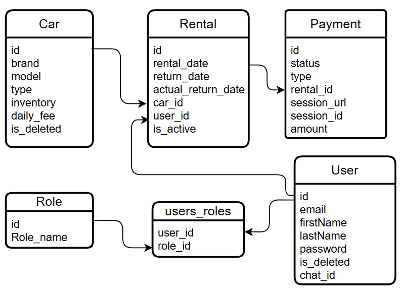

# Online Car Sharing Management Application
***

## Description

This application automates the management of the car rental service. New clients can register, get a list of cars ready for rent, arrange a rental from the cars available in the warehouse. Also receive notifications via telegram about the successful registration of the rental, confirmation of payment, as well as a reminder if the rental is already overdue.
***

## Domain Models

* **User**: Represents a user in the system, including their personal information nd associated with a single role that defines their access rights.
* **Role**: Defines true access by dividing into manager and customer.
* **Car**: Represents a list of available cars, including their brand, model, type and daily fee.
* **Rental**: Represents a booking made by the user to rent the selected vehicle, tracks the rental start and end dates.
* **Payment**: Processes rental financial transactions, uses Stripe API to securely process payments.

## Project structure


***

## Technologies

* **Spring Boot v.3.3.0**
* **Spring Security v.6.3.0**
* **Spring Web v.6.1.8**
*  **Spring Data JPA v.3.3.4**
*  **JWT (JSON Web Tokens) v.0.12.6**
*  **Lombok v.1.18.32**
*  **MapStruct v.1.5.5.Final**
*  **Swagger v.2.3.0**
*  **MySQL v.8.0.33**
*  **Liquibase v.4.27.0**
*  **Docker v.27.5.1**
* **Stripe API v29.2.0**
* **Telegram API, telegrambots v6.1.0**
* **Test containers v1.18.0**
***

## Endpoints


### Available for all users:
* POST: /api/auth/register (To register a new user with role 'CUSTOMER')
* POST: /api/auth/login (To get JWT tokens)


### Available for registered users

* GET: /api/users/me (Get your profile info)
* PUT: /api/users/me (Update your personal data)
* GET: /api/cars (Get a list of cars ready for rent)
* GET: /api/cars/id (Get car by id)
* GET: /api/cars/search (Find car by specific parameters, like car brand or car type)
* POST: /api/payments (Create a new payment)
* POST: /api/payments/success (Updates payment status to 'PAID')
* POST: /api/payments/cancel (Endpoint for redirection in case of payment cancellation)
* POST: /api/rentals (Create new rental)
* POST: /api/rentals/return (Set actual return date car, close rental)


### Available for manager
* PUT: /api/users//{id}/role (Update user role, This access is only available to the manager)
* POST: /api/cars (Create new car and save to DB)
* DELETE: /api/cars/id (Delete car by id)
* GET: /api/payments/id (Find payment by id)
* GET: /api/rentals/id (Find rental by user id)
* GET: /api/rentals/isActive (Get rentals by status 'active' or 'overdue'")

***

## API using instructions

Before you begin, make sure you have installed:
* Java (JDK version 17 or higher)
* Maven
* MySQL
* Docker Desktop
* Git
* Telegram on your PC or phone (optional)

1. Clone this API
```
   git clone https://github.com/slava-moiseev-kramatorsk/carsharring-app.git
   cd your_repo_name
   ```
2. Set up the database
   Create a ```.env``` file and configure it
```
STRIPE_SECRET_KEY=your personal Stripe key
TELEGRAM_API_KEY=your telegram API key
BOT_USER_NAME=your telegrambot user name

MYSQLDB_ROOT_PASSWORD=your DB password
MYSQLDB_DATABASE=your DB name
MYSQLDB_USER=user_name
MYSQLDB_LOCAL_PORT=3307
MYSQLDB_DOCKER_PORT=3306
SPRING_LOCAL_PORT=8088
SPRING_DOCKER_PORT=8080
DEBUG_PORT=5005
```

3. Build and run the application

```
mvn clean package
docker-compose up --build
docker-compose down
```
4. For ease of use, a user with the manager role was added.  Username: "admin@gmail.com", password: "qwerty123"


5. Important! if you want to receive notifications via telegram, then you need to add a chat, you will find a link to it when creating your personal chatbot using 'Telegram Bot Father'. Next you need to write a message "/start", and follow the instructions to enter yours email. This way this chat will be assigned to you. The same will happen to all users who want to receive notifications.


6. Access Swagger UI

For API description and usage, open the link in your browser
```http://localhost:8088/swagger-ui/```

7. API Testing

Import the provided [Postman Collection](https://.postman.co/workspace/My-Workspace~0750f7c0-aec3-4052-85bf-d5e8b8680438/collection/36728804-5bd833e3-86cb-4932-a853-aaedf9a0fded?action=share&creator=36728804) to test API endpoints.